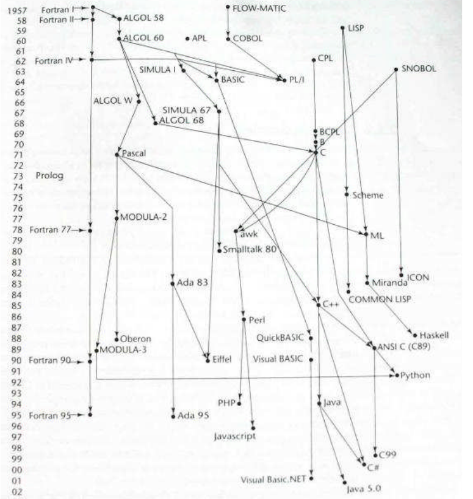
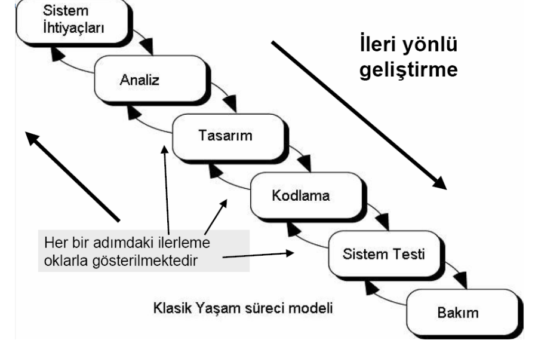
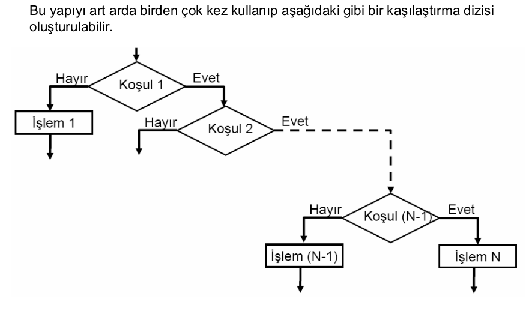

# Algoritmalar
Burası Temel Bilgisayar ve algoritma notlarımın olduğu yerdir.

# 1. Temel Kavramlar
## Bilgisayar
Verilen bilgileri saklayan, gerektiğinde bu bilgileri hızlı bir şekilde istenilen amaca uygun kullanmayı sağlayan/işleyen, mantıksal ve aritmetiksel işlemleri çok hızlı biçimde yapan bir makinedir. Bilgisayar terimi İngilizce “computer” kelimesinin  dilimize çevrilmiş halidir. Bu terim de Latince “compurate” kelimesinden gelmektedir.

Farklı bir tanım ile ; Bilgisayar, kullanıcıdan aldığı verilerle mantıksal ve aritmetiksel işlemleri yapan yaptığı işlemlerin sonucunu saklayabilen, sakladığı bilgilere istenildiğinde ulaşılabilen elektronik bir makinedir. Bu islemleri yaparken veriler girilir ve işlenir. Ayrıca, istenildiğinde yapılan işlemler depolanabilir ve çıkısı alınabilir.

**Giriş:** Kişi tarafından veya bilgisayar tarafından sağlanan verilerdir. Bu veriler, sayılar, harfler, sözcükler, ses sinyalleri ve komutlardır. Veriler giriş birimleri tarafindan toplanır. İşlem: Veriler insanların amaçları doğrultusunda, programın yetenekleri ölçüsünde işlem basamaklarından geçer.

**Bellek:** Verilerin depolandığı yerdir. Giriş yapılan ve işlenen veriler bellekte depolanır.

**Çıkış:** Bilgisayar tarafından işlem basamaklarından geçirilerek üretilen yazı, resim, tablo, müzik, grafik, görüntü, vb.nin ekrandan ya da yazıcı, hoparlör gibi degişik çıkış birimlerinden alınmasıdır.

Bilgisayarın nasıl çalıştığını öğrenmek için onun bilgileri nasıl kullandığını anlamak gerekir. Harfler ve rakamlar  bilgisayarda kodlar şeklinde ifade edildikten sonra kullanılır. Bilgisayarlarda kodlar elektrik olarak voltajın olup olmaması ile ifade edilir. Voltaj var, lamba yanıyorsa 1; voltaj yok, lamba yanmıyorsa 0 kodlarını alır. İki durumlu olan bu kodlamaya "ikilik sistem" denir. Bilgisayara tuşlardan verilen her bilgi 1 ve 0 kodlarına çevrilir. Her 0 ve 1, bit olarak; sekiz bitlik grup ise byte olarak tarif edilir. Bilgisayar, işlemlerini ikilik sayı sistemi ile yapar. İşlemler çok sade ve basit olmakla beraber çok hızlıdır.

Bilgisayarlar sadece sayıları saymakla kalmayıp karar da  verebilir. Bu kararlar, Boolean matematiği denilen mantık kaideler
kaidelerine ine göredir. Çeşitli şartlara göre bilgisayar EVET, HAYIR, VE, VEYA, DEĞİL gibi kararlar alabilir. Mesela; evi taşımak için bir kamyon VE bir şoföre ihtiyaç vardır. Bu kamyon bir dar köprüden geçmek zorundaysa kamyon geniş VEYA yüksekse köprüye çarpar. Taş Taşınacak ev boş DEĞiL ise taşıma işlemi
gecikecektir. Burada VE, VEYA,DEĞİL kararları verilmiştir.


### Bilgisayarların Gelişimi
#### Mekanik Çağ
<br>
Blaise Pascal (1642) Vites tabanlı toplama makinası

<br>
Gottfried Wilhelm von Leibniz (1670) Toplama, çıkarma, çarpma, bölme Mekanik olarak sık sık arızalanırdı.

<br>
Joseph Jacquard (1810) Bilgisayar tabanlı halı dokuma makinesi

<br>
Delikli Kart (Punch Card)

<br>
The Difference Engine (1822) Charles Babbage

<br>
Punch card’lar üzerinde yazılan programları işleyebiliyordu, Bilgiyi belleğinde saklayabiliyordu.

#### Elektro Mekanik Çağ(1840-1940)
<br>
Hermann Hollerith ( 19’uncu yüzyılın sonları).Amerikan oy sayımlarına kullanıldı.Elektrik ile çalışıyor.Bilgi punch card ile veriliyor.Nüfus: 63 milyon; 6 hafta,International Business Machines (IBM)’in ilk ürünü.

<br>
Howard Aiken + IBM + Harvard (1930) Veri depolama: Mekanik röle telefon anahtarları (switch). Girdi: Punch Card

#### İlk Yazılım Bug'ı
<br>
Grace Hopper (1909 – 1992) Mark I’in ilk programcılarından. Derleyicinin mucidi.

#### Elektronik Çağ(1840-Bugün)
Elektronik ile ilgili ilk deneylerin vakum tüplerinde
yapılan çalışmalar olduğu kabul edilir. Heinrich
Geissler (1814-1879), cam tüpün içinden havanın
çoğunu çıkartmış ve bu tüpün içinden elektrik akımı
geçirildiğinde tüpün parıldadığını görmüştür.

Sir William Crookes (1832-1919) havası alınmış
cam tüp’ün (vakum tüp) içinden akım geçirdiğinde,
geçen akımın parçacıklardan oluştuğunu görmüştür.

Sir Joseph Thompson (1856-1940) bu parçacıkları
ölçmeyi başarmıştır ve bu parçacıklara daha sonra
elektron denilmiştir.

John Ambrose Fleming, 1904 yılında, vakum tüpünü
kullanarak akımın tek yönlü olarak akmasına izin veren
vakum tüp diode’u geliştirmiştir. Bu cihaza “Fleming valve”
veya radio tube’de denir.

1930 yıllarında, elektronik dünyasında bir çok gelişme olmuştur. Bu yıllarda ilk elektronik hesap makineleri geliştirilmeye başlanmıştır.

John Atanasoff ve lisansüstü öğrencisi Clifford Berry, 1939 yılında, ABC (Atanasoff-Berry Computer) olarak adlandırılan ilk ikili sayı sisteminde çalışan makineyi geliştirmişlerdir. Bu makinada lojik işlemler için vakum tüpleri ve hafıza için kondansatörler kullanılmıştır.


Savaş sırasında bilgisayar konusundaki çalışmalar çok daha hızlı bir şekilde geliştirilmiştir. John von Neumann, 1946 yılında, ilk bilgisayar olarak kabul edilen Eniac’ı geliştirmiştir.


John Mauchly and J. Presper Eckert geliştirmiştir. 1946’da tamamlandı İlk olarak 2’inci dünya savaşında gizli bir proje olarak başladı.(University of Pennsylvania)


1000 metre kare alan kaplıyor,30 ton ağırlığında ve 17 binden fazla vacum tüpleri kullanıyordu.ilk gerçek bilgisayar. Programlama kablo temasları ve switch ayarları ile yapılıyordu.


1945 yılında Bell laboratuarlarında bir araştırma grubu kurulmuştur. Grubun amacı: iletkenler, yarıiletkenler, yalıtkanlar, piezoelektrik malzemeler ve manyetik malzemeler üzerinde temel araştırmalar yapmak, olarak tanımlanmıştır. Burada yapılan yarıiletkenler konusundaki çalışmalar sonucunda, Walter Brattain, John Bardeen ve William Shockley tarafından tranzistör icat edilmiştir. 1950 yılında bu yeni devre elemanının patenti alınmış ve 1951 yılında da Allentown Pennsylvania’da ticari olarak
üretilmeye başlanmıştır. Tranzistörün icadı elektronikte devrim niteliğindedir.


1950’li yıllarda yapılan araştırmalar sonucunda çok sayıda tranzistör, diyot ve kapasiteden oluşan devrelerin bir bütün olarak gerçekleştirilmesi yolu bulunmuştur. Böylece ortaya tümdevreler veya entegre devreler(integrated circuit) çıkmıştır.


1960 ve 1962 yılında yapılan çalışmalarda tümdevre teknolojisine
BJT’lere göre daha uygun olan Metal-oksit-yarı iletken alan etkili
tranzistör (metal-oxide-semiconductor field effect transistor-
MOSFET) geliştirilmiştir (Kahng ve Atalla, 1960), (Hofstein ve
Heinman, 1963). MOSFET transistorlerin gelişmesi ile birlikte tümdevre içine çok daha fazla sayıda transistor yerleştirilebilmiştir. Bir tümleşik
devredeki eleman sayısı 1964’te 40’a ve 1972’de 1200’e
yükselmiştir. 1982’li yıllarda VLSI (Very Large-Scale Integration)
olarak isimlendirilen sistemlerde 100,000’ler mertebesinde
eleman içeren tümleşik devreler gerçekleştirilmiştir.
Günümüzde bu elaman sayıları çok daha büyük değerlere
ulaşmıştır.


- Microprocessor :CPU içeren tek bir chip İlk olarak 1970 yılında Marcian Hoff (Intel Corporation) tarafından tasarlandı.
- Microcomputer :masaüstü boyutlarında bilgisayar ALTAIR (1975) Apple (Stephen Wozniak ve Steven Jobs; 1977)


### Temel Bilgisayar Mimarileri
**Von Neumann Mimarisi**


**Harvard Mimarisi**
Günümüz tipik bilgisayarları Von- Neumann Mimarisine
sahip Mikroişlemciler kullanırken (Intel x86, Pentium, AMD
Athlon..) , Özellikle Görüntü, ses işleme, yüksek hız
gerektiren uygulamalarda Harward mimarisine sahip
mikroişlemlerciler (DSP’ler, ARM Cortex..)


### Bilgisayar Sistemi
Donanım fiziksel aygıtlardır.Yazılım ise yapılması gereken işleri yapabilmek için donanıma komutlar veren programlar topluluğudur.


#### Donanım

Görevleri yapabilmek için komutları işleyen mikroişlemciye CPU denir.

**CPU :** Kontrol Ünitesi,Aritmetik Mantık Ünitesi(Arithmetic Logic Unit),Register


##### Bellek Türleri
- Registers: CPU’nun bir parçası; çok hızlı; sınırlı büyüklükte
- Cache Memory: CPU’nun bir parçası; RAM’den daha hızlı
- Read-only Memory: Bilgisayarın sürekli ihtiyaç duyduğu sistem komutlarını
barındıran çip
- Random Access Memory (RAM): Ana karta eklenen bellektir, program komutları ve veriler için birincil depo


##### Diğer Bilgisayar Bileşenleri
- Veri Depolama Sistemi: Hard disk, tape, floppy, DVD vs. Geniş alan, ucuz, yavaş, manyetik ve optik
- Input Cihazlari: Klavye, Fare, Dokunmatik ekran, Tarayıcı,
Webcam,Joystick,Mikrofon
- Output Cihazları: Monitör, Yazıcı, Plotter, Hoparlör

### Yazılım


1. Sistem Yazılımı
    1. Aygıt Yazılımı (firmware) (Bios)
        - Sistemi oluşturan donanımların çalışması için greekli olan yazılımlardır.
    2. İşletim Sistemi
        - Kullanıcı arayüzü, ağ bağlantı arayüzleri, Dosya erişimi ve organizasyonu, Çoklu çalışma gibi hizmetlerisağlayan yazılımlardır. Örneğin: DOS, Windows, Linux, PARDUS, Unixvs..
    3. Sistem Destek Yazılımı
        - Sistemle ilişkili faydalı yazılımlardır. Örneğin,Disk formatlayıcı, hesap makinesi, test ve iletişim yazılımları, Hyperterminal, Telnet vs..
    4. Sistem Geliştirme Yazılımı
        - Bunlar, çeşitli kütüphaneler, Uygulama Programı arayüzü(API) (Winsock, setupapi, mmtools, SAPI, DDK..),Derleyiciler, Debugger’lar..

2. Uygualama Yazılımı
    1. Genel Amaçlar
        - Kelime işlem programları: MS-Word, Word-Pro, ...
        - Veri tabanı yönetim programları: Oracle, Access, SQL, ...
        - Hesap Tablosu programları: MS-Excel, Lotus, ...
        - Grafik ve çizim programları: AutoCAD, 3D MAX, Photoshop, Corel Draw, ...
        - Matematik tabanlı programlar: MATLAB, MatCAD, Mathematica, ...
    2. Uygulamaya Özel
        - Özel yazılımlar
#### Yazılımda Olması Gereken Temel Özellikler
1. **Doğruluk :** Yazılımın belirtilmiş ihtiyaçlarını karşılamasıdır.
2. **Güvenilirlik :** Gerekli işlevi ne hassaslıkla yerine getireceği beklentisidir.
3. **Verimlilik :** İşlevin gerçekleştirilmesi için kullanılması gereken bilgisayar kaynakları ve kod miktarıdır.
4. **Güvenlik(Bütünlük):** Yazılım ve bilgilerine, istenmeyen insanlarca ulaşımın ne derece engellenebildiğidir.
5. **Kullanılabilirlik :** Programın öğrenilmesi, çalıştırılması, girdi hazırlama ve çıktı yorumlama işlemlerinin kolaylık derecesidir.
6. **Hata bulma kolaylığı :** Hatanın yerini bulma ve düzeltme kolaylığıdır.
7. **Esneklik :** Yazılımda değişiklik yapma kolaylığıdır.
8. **Taşınabilirlik :** Programın farklı donanımlarda ve yazılım sistemi ortamlarında kullanılmasıdır.
9. **Tekrar kullanılabilirlik :** Yazılım tamamının ya da bir bölümünün farklı bir uygulamada kullanılabilmesidir.
10. **Birlikte çalışabilirlik :** Bir yazılım sisteminin diğerleri ile bağlantı sağlaması kolaylığıdır.
#### Program ve Yazılımın Tanımı
- **Program :** belirli bir işi gerçekleştirmek için gerekli komutlar dizisi olarak tanımlanabilir.
- **Programlama :** Bir programı oluşturabilmek için gerekli
komutların belirlenmesi ve uygun biçimde kullanılmasıdır.
- **Programlama Dilleri:** Bir programın oluşturulmasında
kullanılan komutlar, tanımlar ve kuralların belirtildiği
programlama araçlarıdır.
- **Yazılım :** Belirli bir amacı sağlayan, program yada programlar ve ilgili dokümantasyonlardır.Bir başka deyişle var olan bir problemi çözmek amacıyla bilgisayar dili kullanılarak oluşturulmuş anlamlı anlatımlar bütünüdür.

### Programlama Dilleri
Bilgisayarlara ne yapmaları gerektiğini söylememizi sağlayan özel bir dil Tüm yazılımlar programlama dilleri ile yazılır.
İster genel ister özel amaçlı olsun tüm uygulama ve sistem yazılımları programlama dilleriyle yazılır. Bir programlama dili, insanların bilgisayara çeşitli işlemler yaptırmasına imkân veren her türlü sembol, karakter ve kurallar grubudur. Programlama dilleri insanlarla bilgisayarlar arasında tercümanlık görevi yapar. Programlama dilleri, bilgisayara neyi, ne zaman, nasıl yapacağını belirten deyim ve komutlar içerir.


- **Bir programlama dili şunlardan oluşur :**
    - **Genel komutlar :** Programlama dilinin anlayacağı komutlardır.
    - **Gelişmiş komutlar :** Genel komutları kullanarak oluşturulmuş komutlardır.
    - **API komutları :** İşletim sisteminin sunduğu özellikleri kullanan komutlardır.
    - **Derleyici komutları :** Komut içinde çalışmayıp derleme esnasında alınan bilgilere göre derleme yapılmasını sağlar.
    - **Aktif nesneler :** ‘Buton, Menü, Gösterge çubuğu ve Tabpanel’ gibi bileşenlerin genel adıdır.

- **Makine Dili (birinci seviye):** Makine dili mikroişlemci ya da mikrodenetleyici gibi komut işleme yeteneğine sahip entegrelerin işleyebilecekleri komutlardan ve buna uygun söz diziminden oluşan dile verilen addır. Makine dili, işlemcinin verilen komutlar doğrultusunda çalıştırılmasını sağlayan ve işlemci mimarisine göre değişen en alt seviyedeki programlama dili dilidir. Bu dil sadece 0 ve 1 ikililerinin anlamlı kombinasyonlarından meydana gelmektedir. Bu nedenle, makine dilinin anlaşılması çok güçtür.

    Sonuç olarak bilgisayar programı hangi dilde olursa olsun formatı makine diline çevrilmesi evrilmesi gereklidir. Her emrin yerine getirilmesine ‘Instruction Cycle’ denir ve 4 ana kısımdan oluşur;
    - Fetch: Bir sonraki emri hafızadan getir.
    - Decode: Emrin ne demek istediğini çöz.
    - Execute: Emir yerine getirilir, işlem yapılır.
    - Store: Sonucu sakla.

    Kısaca özetleyecek olursak;
    - Bilgisayarın doğal dilidir.
    - Bilgisayarın donanımsal tasarımına bağlıdır.
    - Makine dili “010101001”’lerden oluşan komutlardır ve bunlar doğrudan makineye hitap eder.
    - Makine dili işlemci türüne özel olarak yazılmaktadır Dolayısıyla, bir işlemci türü için makine diliyle yazılmış program, diğer işlemciler için uygun olmamaktadır.
    - Bilgisayarın ana dilidir.
    - Bilgisayarın anlayabildiği tek dildir.
    - Assembly Dili (ikinci seviye):
    - Makine diline birebir çevrilebilir
    - Makine dilinden daha rahat okunabilir.
        örn: ADD X Y Z
    - Assembler-assembly dilini makine diline çeviren program
- Procedural diller (üçüncü seviye):
    - Bir komut pek çok makine dili komutuna karşılık gelir
    - Programlarda bilgisayarın işlem akışını adım adım tasarlayabilirsiniz.
    - İnsan diline daha çok benzer; bilinen kelimeleri kullanır
        Örnek: C, C++, Java, Fortran, QuickBasic
    - Derleyici (compiler) – programın tümünü assembly veya makine diline çevirir (C++, Pascal, Ada).
    - Interpreter – program çalıştırıldığında adım adım programı makine koduna çevirir (Basic, Javascript, LISP)
- Nonprocedural diller(dönrdüncü seviye):
    - Kullanıcının sadece gerekli sorguyu göndermesi sonuca ulaşması için yeterlidir.Örnek: – veritabanı sorgulama dili- SQL
    - Teknik olmayan insanlar tarafından da kullanılabilir.
- Natural Language Programing
    - İnsan Dilini programlama diline çevirir
    - Oldukça karmaşık olarak nitelendirilir.
- Alt seviye diller
    - sembolik makine dili(Assembler)
- En Alt seviye dil
    - En alt seviye dil makine dilidir tamamen 0 ve 1 lerden oluşur


#### Programlama Dillerinin Tarihçesi
İlk programın, Ada Lovelace tarafından Charles Babbage’ın tanımlamış
olduğu “Analytical Engine” i ile Bernoulli sayılarının hesaplanmasına
ilişkin makalesinde olduğu söylenmektedir. Bu nedenle ilk gerçek
anlamdaki programlama dillerinden birinin adı Ada Lovelace anısına
ADA olarak isimlendirilmiştir.1940 larda ilk modern bilgisayar ortaya
çıktığında, programcılar yalnızca assembly dili kullanarak yazılım
yapabiliyorlardı.

- (1950 – 1960)
    - FORTRAN (1955), the"FORmula TRANslator
    - LISP, the"LISt Processor",
    - COBOL, the COmmon Business Oriented Language
    - ALGOL Algorithmic Language


**Dillerin Soy Ağacı**<br>


### Yazılım Geliştirme Araçları
1. **Editörler-Tümleşik geliştirme ortamları(IDE):**
    - **Editörler :** Program kodlarını yazmak için kullanılan, metin düzenleyicilerdir. Program kodları saf metin biçiminde yazıldığından, herhangi bir metin düzenleyicisi, program yazılımı için kullanılabilir.
        - Kodlamadaki hatalar görülmez.
        - Anahtar kelimeler, fonksiyonlar ve parametreleri renklendirilmediğinden kod yazmak daha zordur.
        - Breakpoint, yada watch gibi, hata ayıklama unsurları yoktur.
        - Program derleme ve bağlama işlemi editör dışında genellikle komut satırı üzerinde yapılır.
    - **IDE (Tümleşik Geliştirme Ortamları) :** Tümleşik geliştirme ortamları, Genellikle derleyicileri–bağlayıcıları ortam içinden kullanabilmeyi yada derleyici ve bağlayıcıya ortam içinden erişme yollarını sağlarlar (Makefilevs..). Bunun yanı sıra;
        - Derleyici ve bağlayıcı tümleşik olan yapılarda Hata ayıklama, Gözlem penceresi gibi bileşenler mevcuttur.
        - Yazım işlemini kolaylaştıracak vurgulamalar ve uyarılar mevcuttur.
        - Derleyici ve bağlayıcı parametreleri menülerden ayarlanabilir.
        - Yardımlar mevcuttur.
        - Her yazılım dilinin kendi IDE si mevcuttur. Ancak bazı IDE’ler birden fazla yazılım dili için ortam sağlayabilir.
2. **Derleyicilerle birlikte kullanılır :** Bir Programalama dilinde yazılmış olan kaynak kodunu başka bir dile(genellikle makine koduna) çeviren yazılımlara derleyici denir. Bir derleyici, bir metin editörü yada IDE üzerinde yazılan program kodlarını, makinenin anlayabileceği OBJ kodlara dönüştüren bir uygulama yazılımıdır. Derleyicilerin birçoğu, Program dilinin yanısıra makine dilinin(assembly) de kullanılmasına izin verir.<br>
    - örnek :<code>x=2+y</code> kodunu bir programalam dili ile yazılmış okunabilir kod olarak düşünelim.
    ```assembly
    LOAD A [0]      ;; belleğin 0 adresindeki veriyi A siciline yükle
    ADD A BX        ;; A siciline BX sicilindeki adreste bulunan veriyi ekle
    STOR A [100]    ;; sonucu 100 adresine yaz
    ```
    Bu örnekte çevirinin hedefi, programcının anladığı kaynak kodundan işlemcinin anladığı 0 ile 1’den oluşan makine dili kodunu üretmektir (LOAD, ADD ve STOR komutları 0001, 0011 ve 0010 olarak yorumlanır.)<br>
    
3. **Derleyiciler-Bağlayıcılar (Compilers–Linkers):** Bir bağlayıcı, derleyici tarafından derlenmiş olan OBJ program kodlarını uygun bellek bölgelerine yerleştirerek, değişkenlerin ve sabitlerin bellek atamalarını ve ilklemelerini gerçekleyerek tek bir çalıştırılabilir program elde eden bir uygulama yazılımıdır (windows için exe dosya).
    
4. **Yorumlayıcılar (Interpreter) :** Yorumlayıcılar, program kodunu bir bütün olarak değerlendirmez. Program kodunu satır, satır yorumlayarak çalıştırırlar. Bu nedenle günümüzde derleyicilere göre daha kısıtlı uygulamalara sahiptirler, internet uygulamaları ve bilimsel alanda yaygın  kullanılmaktadırlar.<br>
Bazı yorumlayıcılar, yazılan program satırını, daha etkin bir
biçime çevirip, hemen uygularlar. Bunlar arasında: Perl,
Phyton, Matlab, Mathcad gibi yorumlayıcılar sayılabilir.
•Bazı yorumlayıcılar ise, yorumlayıcı sistemin bir parçası olan
bir derleyici tarafından önceden derlenip saklanmış kodları
uygularlar. Java bunlar arasında sayılabilir.

### Sayı Sistemleri
Günlük yaşantımızda 10 luk sayı sistemi kullanılır. Ancak, bilgisayar sistemleri 2 lik sayı sistemini kullanılırlar. 10 luk sistemde taban 10, ikilik sistemde taban 2 dir. Sayı sistemlerinde sayıyı oluşturan her bir rakam digit olarak adlandırılır. Onluk sayı sistemlerinde her bir rakam decimal digit yada sadece digitken, ikilik sistemde binary digit yada kısaca bit olarak adlandırılır.

<code>123456 --> 6 digitlik onlu sayı</code><br>
<code>100101 --> 6 bitlik ikili sayı</code>

Sayı sembolleri 0 .. (Taban–1) arasındadır.
Onluk düzende rakamlar 0..9, ikilik düzende rakamlar 0 , 1 den oluşur.

Sayıların oluşturulması<br><code>123456 = 1x10<sup>5</sup> + 2x10<sup>4</sup> + 3x10<sup>3</sup> + 4x10<sup>2</sup> + 5x10<sup>1</sup> + 6x10<sup>0</sup></code><br>
<code>100101 = 1x2<sup>5</sup> + 0x2<sup>4</sup> + 0x2<sup>3</sup> + 1x2<sup>2</sup> + 0x2<sup>1</sup> + 1x2<sup>0</sup>
</code>

Bilgisayar ortamında dört çeşit sayı sistemi bulunmaktadır.
1. İkilik sayı sistemi(Binary)
    - İkili sayı sistemi 2 tabanını kullanır. 0 ve 1 olmak üzere iki rakamı vardır. Bu sayılar bilgisayarda akımın geçmesi veya geçmemesi esasına göre belirlenir.<br>
    örnek : <code>(001010)<sub>2</sub>, (111011)<sub>2</sub>, (10)<sub>2</sub></code>
    - İkilik sistemden 10'luk sisteme dönüştürmek:<br>
    örnek : <code>(101101)<sub>2</sub>=1x2<sup>5</sup> + 0x2<sup>4</sup> + 1x2<sup>3</sup> + 1x2<sup>2</sup> + 0x2<sup>1</sup> + 1x2<sup>0</sup></code><br>
    <code>32 + 0 + 8 + 4 + 0 + 1=(45)<sub>10</sub></code>
    - 10'luk sistemden ikilik sisteme dönüştürme<br>
    Bu işlemi yapabilmek için 10'lu sistemde verilen sayı sürekli olarak ikiye bölünmektedir.Bölmelerin kalanları bize  osayının ikili sistemdeki karşılığını vermektedir.<br>örnek : 10'lu tabandaki 53 sayısını ikili tabandaki karşılığı;<br>
    
    - ikili sistemden 8'li sisteme dönüştürme<br>
    
    - Sekizliden 2'li sisteme dönüştürme<br>
    
    - İkili sistemden 16'lı sisteme dönüştürme<br>
    
    - Onaltılı sistemden 2'li sisteme dönüştürme<br>
    
2. Sekizlik sayı sistemi(Oktal)
    - Bu sayı sisteminde sadece 0,1,2,3,4,5,6,7 rakamları kullanılır.Bu sayı sisteminin tabanı 8 dir.<br>
    örnek : <code>(25)<sub>8</sub>, (376)<sub>8</sub>, (27510)<sub>8<sub>,</code>
3. Onluk sayı sistemi(Decimal)
    - Bu sayı sistemi günlük hayatta kullandığımız sayılardan oluşur.Yani 0,1,2,3,4,5,6,7,8,9 rakamalarını kapsar, bu sayı sisteminin tabanı 10 dur.<br>
    örnek : <code>(10)<sub>10</sub>, (9999)<sub>10</sub>, (1820918)<sub>10</sub></code>
4. Onaltılık sayı sistemi(Heksadesimal)
    - Bu sayı sisteminde 16 tane rakam bulunmaktadır.1,2,3,4,5,6,7,8,9,A,B,C,D,E,F rakamları ve harflerinden oluşur.Sayı sisteminin tabanı 16 dır.16'lık sayı sisteminde her bir harf bir rakamı  temsil eder.
    - Bunlar <code>A=10,B=11,C=12,D=13,E=14,F=15</code>
        - Bilgisayar sisteminde 1 ve 0'ın yan yana yazılmasıyla 10 sayısı aynı şekilde ifade edildiğinden karmaşıklık olmasından dolayı bu şekilde bir çözüm üretilmiştir.<br>
    örnek : <code>(1029)<sub>16</sub>, (AFDC)<sub>16</sub>, (290A3DC)<sub>16</sub></code>

Sekiz bitlik ikili sayılara bir byte lık sayılar denir<br>
<code>10011101 --> 8 bit yada bir byte</code>
        
16 bit uzunluklu sayılara 1 word luk sayılar sayılar
denmesine rağmen, bu kavram bazen işlemcinin veri yolu
uzunluğu kadar bit sayısı ile de eşleştirilmektedir.
11001001 11100011 2 byte lık sayı.
Ayrıca her 4 bit, bir Nibble olarak adlandırılır.

#### Pozitif ve Negatif  Sayılar
<code>00000000 (decimal 0)</code><br>
<code>11111111 (decimal 255)</code>

Buradaki tüm sayılar, pozitiftir.

Bir başka deyişle sayı işaretsizdir. Negatif sayılar söz konusu olduğunda bu sayıların yarısının pozitif, yarısının negatif olduğu söylenebilir.

Örneğin 1 byte’lıksayı -127 ile +127 arasında değişecektir.İkilik sistemde negatif sayılar, çıkarma işleminin toplama aracılığıyla yapılabilmesini sağlamak amacıyla tümleyen sayılarla gösterilir.Tümleyen sayı, verilen sayıyı, o bit sayısı için temsil edilen en büyük sayıya tamamlayan sayıdır. (Pratikte bit evirerek yapılır.)

Örneğin 00001010 ın tümleyeni 11110101 dir. (255 –10). Bu türden tümleyene 1’e tümleyensayı denir. Dikkat edilirse en ağırlıklı (en soldaki) bit negatif sayılar için 1 olmaktadır. Pratikte pek kullanılmaz, çünkü burada iki tane 0 söz konusudur (0000 0000 ve 1000 0000) ve işlemcinin doğrudan toplamasıyla çıkarma elde edilemez.

* **İkiye Tümleyen**
<br>
* **Hexadecimal sayılar**
Bilgisayar sistemlerinde uzun bit dizilerini temsil etmek zor olacağı için yazım biçimi olarak hexadecimal sayılar tercih edilmektedir. Hex sayılar 16 lık sayılardır. Herbir Nibble bir Hex sayı ile temsil edilebilir. Böylelikle ikili sayının yazım uzunluğu 4 te bir digite düşecektir.<br>
    **Hex sistemde sayılar 16 sembolden oluşur ve aşağıdaki gibidir.**
    <br>
    **örnek:**
    <code>0011 1010=3A Hex</code>, <code>1110 0101=E5 Hex</code>, <code>0101 1101 1100 1001 0110 0111=5DC967 Hex</code>

### Kod Sistemi
Bilgisayarlar yalnızca sayılarla çalışırlar, oysa bizim harflere ve diğer sembollere de gereksinimimiz vardır. Bu semboller de sayılara karşılık düşürülecek biçimde kodlanırlar. Program örneğin bu sayı ile karşılaşırsa ekrana karşılık düşen sembolü basar, yada klavyeden gelen sayının sembolik karşılığını , yazıcıdan çıkarır.

Bir çok kodlama türü olmasına karşın dünyada bilgisayar ortamlarında **ANSI** tarafından 1963 yılında standartlaştırılan **ASCII**(**A**merican **N**ational **C**ode for **I**nformation **I**nterchange) kodlaması yoğun olarak kullanılmaktadır. Ancak günümüzde , **ASCII** kodları çok dilliği sağlayabilmek için yetersiz kaldığından **UNICODE** kodlaması yaygınlaşmaktadır. Ancak pek çok uygulamada **ASCII** kodlaması hala geçerliliğini korumaktadır.

ASCII temel olarak 7 bit’ tir. 127 karakterden oluşur. Ama Extended kısmıyla birlikte 8 bit kullanılmaktadır. Ancak genişletilmiş kısımdaki semboller yazılım ortamına göre değişebilmektedir.

**ASCII ilk 128 sembol**<br>


**ASCII genişletilmiş kısım**<br>


<hr>

# 2.Algoritma
## Temel özellikleri
Algoritmalarda, doğru çözüme ulaşabilmek için, uyulması gereken temel özellikler vardır. Bu temel
özellikler sırasıyla ;
1. **Kesinlik**
    - Algoritmadaki anlatım satırları kesin olmalıdır. Kesin olmayan anlatım satırları algoritmada bulunmamalıdır. Bir algoritmayı yazarken, her programcının programlama bilgisinin aynı olmadığını göz önüne alıp, algoritmadaki cümlelerimizi, kesin ifadelerle belirtmeliyiz. Özetle kesinlik, algoritmanın en önemli temel özelliğidir.
2. **Etkinlik**
    - Bir algoritma etkin olmalıdır. Bir algoritmanın etkin olabilmesi, içinde tekrar anlatımların bulunmamasına bağlıdır. Aşağıdaki algoritmada PI ve R değerleri tanımlanmakta ve sayısal değerler atanmaktadır. Atanan değerlere göre alan hesaplanmaktadır. Tanımlar ve hesaplama işleminin bir kez yapıldığı bu algoritma ETKİN bir algoritma olmaktadır.
    ```
    PI = 3,14
    R = 5
    Alan = PI * R^2
    ```
    Aşağıdaki algoritmada ise, önce PI ve R tanımlanarak değer atanmaktadır. Alan hesaplanmakta ve daha sonra aynı işlemler bir kez daha yapılmaktadır. Benzer işlemlerin iki kez tekrarlanması nedeniyle etkin bir algoritma olmamaktadır.
    ```
    PI = 3,14
    R = 5
    Alan = PI * R ** 2
    PI = 3,14
    R = 7
    Alan = PI * R ** 2
    ```
    İçinde en az tekrar anlatımları bulunduran algoritmalar, en etkin algoritmalar olarak kabul edilir. Dolayısıyla, içinde gereksiz tekrarları bulunduran yazılımlar etkin olamazlar. Bu nedenle, içinde tekrar anlatımları barındıran, bir algoritma tasarlanıyorsa, tekrar anlatımların tamamı için önerilen yol, en az sayıda alt algoritma diye isimlendirdiğimiz anlatımlara yer verilmelidir. Bir başka deyişle; birbirinden farklı fakat aynı türdeki tekrar işlemlerinde, bir tek alt algoritma ile çözüm gerçekleşebilir.

    **Örnek:**<br>
    Bir sınıfa ait öğrencilerin, sorumlu oldukları derslere ait, girdikleri sınavlardan alacakları puanların     ortalamalarını bulan bir yazılımı, bir alt algoritma aracılığı ile gerçekleştirilebilir. Dolayısiyle, her bir öğrenci için ayrı ayrı değil de, bir tek alt algoritma düzenleyip, sonuçlandırmak mümkün olabilir. Benzer olarak; bir işletmenin pazarlama elemanlarının, günlük satış ortalamalarının hesaplanması istenebilir. Dikkat edilirse, yukarıdaki iki örnek, aynı türden olması nedeniyle, aynı yazılım içerisinde, görünüşte ayrı konular olmasına karşın, yukarıda sözü edilen iki ayrı konunun çözümü, tek bir alt algoritma yazılımında gerçekleşebilir. Sonuç olarak söylenebilir ki , bir algoritmanın etkinliği, gereksiz tekrar işlemlerinden kaçınmaya bağlıdır.
3. **Sonluluk**
    - Her algoritmanın bir bitiş noktası veya algoritmanın alt algoritması var ise,bu alt algoritmaların geri dönüş noktası olmalıdır. Bunun anlamı; bir yazılıma ait algoritmanın bittiğini kesinlikle belirtmek gerekir. Aynı algoritma içinde, zaman zaman farklı işlemleri gerçekleştirmek üzere, farklı noktalara geçici olarak, algoritmanın akış yönünü değiştirme gereği olabilir ki, bu yukarıda alt algoritma olarak ifade edildi. Alt algoritmaya nereden gelinmiş ise , geldiğimiz yere, geri dönüş noktası kesinlikle sağlanmalıdır.
    
    **Not:**<br>
    Alt algoritmalara saptığımız noktalar , Ana algoritma dediğimiz algoritma üzerinden gerçekleşmektedir. Fakat, zaman zaman alt algoritma içinden de başka bir alt algoritmaya sapılabilir.Aşağıdaki örnekte olduğu gibi.
    ```
    ANA PROGRAM {
        ALT ALGORİTMA BİR   <- 1.ADIM
        ALT ALGORİTMA İKİ   <- 4.ADIM
        }
    END ANA PROGRAM
    ALT PROGRAM BİR {
        ALT PROGRAM İKİ     <- 2.ADIM
    RETURN
    }
    ALT PROGRAM İKİ {
        ALT PROGRAM İKİ     <- 3.ADIM
    RETURN
    }
    ```
4. Giriş/Çıkış olarak ifade edilirler.
    Algoritmanın son özelliği giriş/çıkış bilgileridir. Algoritma tasarlanırken, bilgi transferi algoritma içine doğru oluyorsa, giriş bilgisini ve bilgi transferi algoritma dışına doğru oluyorsa çıkış bilgisi olmaktadır .

    Bir Algoritmada, giriş bilgisi denildiğinde, kesinlikle giriş bilgisi olacaktır diye bir istem yoktur. Bunun anlamı; giriş bilgisi kullanıcı tarafından girilebilir veya algoritma içinde yaratılabilir yada giriş bilgisi hiç olmayabilir. Ancak, algoritmada çıkış bilgisi denildiğinde, kesinlikle olmalıdır. Bilginin girişi; klavye,bar kod okuyucu, mouse gibi giriş ünitesi diye kabul edilen düzenekler aracılığı ile sağlanmaktadır. Bilginin çıkışı ise; ekran veya yazıcılar aracılığı ile sağlanmaktadır.

    Giriş ve Çıkış işlemleri için örneklersek; algoritmada bir bilginin giriş işlemi için okunabilmesi; READ ifadesi kullanılarak, değişken diye isimlendirdiğimiz, veri isimleri aracılığı ile gerçekleşmektedir.

**Aritmetik öncelikli işlem sırası**<br>
|   | Anlamı       | Sembol |
|---|--------------|--------|
|1. |Üs alma işlemi| ^      |
|2. |Çarpma işlemi | *      |
|3. |Bölme işlemi  | /      |
|4. |Toplama işlemi| +      |
|5. |Çıkarma işlemi| -      |

Not: Aritmetik operatörlerinin tamamının bulunduğu bir formül içinde, ayrıca parantez ile ifade edilen aritmetik işlemler de bulunuyorsa, parantez içindeki işlemler öncelik sırası olarak yukarıda verilen sıra aynı şekilde uygulanır ve daha sonra parantez dışındaki işlemler yukarıda verilen sıraya göre gerçekleştirilir.

**İlişkisel işlemler**<br>
İki farklı ifadenin karşılaştırılarak, bir karar işlevini yürütebilmek için kullanılan işlemcilerdir (Operatör). Bir başka deyişle, iki farklı ifadenin karşılaştırılması sonucunda yapılacak işlemin, seçilebilme işlevinin yürütülmesini sağlayan operatörlerdir. İlişkisel işlemcilerin aşağıda sembol ve anlamları verildiği gibidir.
| | Anlamı  | Sembol                |
|---|-------|-----------------------|
|1. | >     | büyüktür              |
|2. | <     | küçüktür              |
|3. | =     | eşittir               |
|4. | >=    | büyük veya eşittir    |
|5. | <=    | küçük veya eşittir    |
|6. | ^=    | eşit değildir         |


**Mantıksal işlemler**<br>
Mantıksal işlemler; AND,OR,NOT gibi işlemcilerle belirlenen koşul veya oşullara bağlı olarak ifadeler test edilirler. Test işlemleri, koşulların doğru yada yanlış oluşlarına göre bir sonuç vermektedir. AND (VE) işlemcisi: İki farklı ifade (veri veya bilgi), ayrı koşullarda karşılaştırılarak, koşulların doğruluğu araştırılır. Karşılaştırma sonucunda, her iki ifade için, her iki koşulun doğruluğuna bağlı olarak bir işlem yürütülür.OR (VEYA) işlemcisi : İki farklı ifade (veri veya bilgi), ayrı koşullarda karşılaştırılarak, koşulların doğruluğu araştırılır.Karşılaştırma sonucunda, her iki ifade için, her iki koşuldan birinin gerçekleşme durumuna bağlı olarak bir işlem yürütülür.NOT(DEĞİL)işlemcisi:Verilen ifadenin ters koşuluna göre test işlemi yürütülür

## 2.1 VERİ
Üzerinde işlem yapabildiğimiz her türlü ifade, veri diye isimlendirilir. 

**VERİ ÇEŞİTLERİ**<br>
Veriler, sayısal ve alfa sayısal olmak üzere iki ayrı grupta değerlendirilmektedir.
**Sayısal :** Sayısal verileri; tam sayılar ve ondalık sayılar olmak üzere iki grupta ifade edilir. Sayısal verileri gruplarken, sayıların negatif ve pozitif olma özellikleri de düşünülerek gruplandırılmıştır.

**Tam sayı özelliği:** İçinde nokta içermeyen 0(sıfır)sayısı dahil, 9(dokuz) sayısı dahil aradaki sayılardan oluşan tüm sayılara tam sayı denir.

**Alfa sayısal (Alfabetik):** A – Z karakterleri dahil aradaki tüm karakterler ve 0 – 9 sayıların tamamı alfa sayısal (alfabetik) olarak kabul edilir.

### VERİLERİ TANIMLAMA
Veri (bilgi), bilgisayar ortamında üzerinde işlem yürütülen ifadeler olarak bilinir. Veri üzerinde, herhangi bir işlemi yürütebilmek için ,veri girişi, dış ortamdan gerçekleştirildiğinde, bilgisayarda rasgele erişimli bellek (RAM) denilen ortamda tutulmaktadır. 

Klavyeden bir veri girildiğinde, doğrudan doğruya bellekte belirlenen bir alanda tutulacaktır. Bu nedenle, veri girişi gerçekleşmeden önce veri için, beleğin belli bir yerinin o veriye ayrılması için, ilgili yer, kullanıcı tarafından isimlendirilmelidir. Bir başka deyişle; belleğin hangi yerinde veri tutulursa tutulsun, ilgili yerin, verinin türüne ve özelliğine bağlı olarak, kullanıcı tarafından verilecek bir isimle bellekte bir yer belirlenip ,ayrılacaktır. Bu yer belirleme işleminden sonra veri girişi kullanıcı tarafından gerçekleşecektir. Kısaca, belleğe bir veri girişinin yapılabilmesi için, mutlaka verilecek bir isimle, bellekteki verinin yeri belirlenmelidir. Bilgisayar ortamında veriler üzerinde işlem yapılabilmesi için bellekte bir yer ayrılması ve ayrılan bu yerin de isimlendirilmesi gerektiğini ifade ettik. İsimlendirme yapılırken, algoritma veya bir program dili içinde verinin nasıl değerlendirileceğine bağlı olarak gerçekleştirilir. Bu nedenle, genel anlamda verileri iki grupta değerlendiriyoruz. Bunlar;
1. Sabitler
    Bir programın çalışması sırasında, program başlangıcından, program sona erinceye kadar değeri değişmeyen ifadelere sabit denir. Algoritmada sabitleri sayısal ve alfa sayısal olarak ikiye ayırıyoruz.
    - **Sayısal Sabitler:**
        0 – 9 dahil arasındaki sayılardan oluşan sayıların tamamı sayısal sabit olarak kabul edilir. Sayısal sabitler iki grupta değerlendirilir. 
        - **Tam Sayı Sabitleri :** İçinde nokta içermeyen , pozitif ve negatif sayıların tamamına denilir. tam sayı sabitleri `Örnek: 127 , -128 , -32768 , +32767 , 0 , 12345` gibi sayılar.
        - **Ondalık ( Gerçel ) Sayı sabitleri:** İçinde nokta bulunan, pozitif ve negatif sayıların tamamına ondalık yada gerçel sayı sabitleri denilir. Bu sayıları da kendi içinde iki gruba ayrılmaktadırlar.
            - **Sabit Noktalı Ondalık ( Gerçel ) Sabit Sayılar:** Sayı içindeki noktanın yeri değişmiyorsa, sabit noktalı gerçel (ondalık) sayılar denir. `Örnek : 1.5 , - 89.67 , +0.05 , +127.87` gibi sayıları verebiliriz.
            - **Kayan Noktalı Ondalık ( Gerçel ) Sabit Sayılar :** Eğer sayı içindeki noktanın yeri değişiyorsa bu tip sayılara kayan noktalı (gerçel) sabit sayılar denir.`Örnek : 1.5 E-23, 9.6E+15 , +1.7D-10` gibi sayıları verebiliriz.

            Diğer taraftan, ondalık (gerçel) sabit sayılar ikiye ayrılırlar.  bunlar;Tek duyarlıklı ondalık (gerçel) sabit sayılar. Çift duyarlıklı ondalık (gerçel) sabit sayılar.

            - **Tek duyarlıklı ondalık (gerçel) sabit sayılar:** Gerçel sayının, noktadan sonra en fazla 7 basamak yürütülebilen sayı tiplerine denir. 
            - **Çift duyarlıklı ondalık (gerçel) sabit sayılar:** Gerçel sayının, noktadan başlayarak 7 haneden fazla ve 17 haneye kadar gösterilen sayılara denir. Kayan noktalı sabitlerde E karakteri sayının tek duyarlıklı (Single precision) olduğunu, kayan noktalı sabitlerde D karakteri sayının çift duyarlıklı (Double precision) olduğunu  göstermektedir.
            - **Alfasayısal (Alfabetik) sabitler:** 0 – 9 sayıları ve aradaki sayılar. A–Z, a-z arasıdaki karakterler ve tüm özel karakterler alfa sayısal ( Alfabetik ) sabitler olarak isimlendirilirler. Alfabetik sabitler gösterilirken (‘ ‘ ) tek tırnak aralığında gösterilirler. Ancak, boşlukta bir karakter olarak kabul edilir ve ‘’ olarak gösterilir.
2. Değişkenler
Bir programın çalışması sırasında, program başlangıcından, program sona erinceye kadar değeri değişebilen ifadelere değişken denir. Bir Pascal programlama dilinde değişkenleri tanımlarken bilinmesi gereken kurallar vardır. Bunlar
aşağıda açıklandığı gibidir.

- İsimlendirme Kuralları
    - Değişkenlere verilecek isim mutlaka bir harf ile başlamalıdır. Harf karakterinden sonra sayısal değerler verilebilir.Sayı karakterleri ve özel karakterler ile başlayan isimler geçerli isim kabul edilmez.
    `Örnek: ?ad, !SAY , 2ISIM` gibi tanımlar geçersizdir.
    - Değişken ismine ait karakterler arasında boşluk karakteri olamaz. Pascal dilinde boşluk yerine alt çizgi ( _ ) karakteri kullanılabilir.
    - Değişken isminde türkçe karakter kullanılamaz.
    -Değişkenlere verilen isim karakterleri arasında `, * , ! , ? , & , ; , ( , ),` gibi özel işaretler kullanılamaz.
    - Programlama diline ait komutlar değişken ismi olarak kullanılamaz.
    -Değişkenler iki grupta değerlendirilir. Bunlar, sayısal ve alfa sayısal değişkenler olarak ifade edilirler.
    - Sayısal değişkenler: 1,2,3,4,5,6,7,8,9 ve 0 sayıları dahil bu sayıları temsil eden ifadelere denir.
    - Sayısal değişkenleri, tam sayı ve gerçel sayılar olarak iki grupta değerlendiriyoruz.
    - Alfa sayısal (Alfabetik) değişkenler: Özel karakterler dahil tüm karakterler ve karakter dizileri temsil eden ifadelere denir.

## Problem Çözme ve Algoritma
Problem Çözme Tekniği (Descartes’e göre):
1. Doğruluğu kesin olarak kanıtlanmadıkça, hiçbir şeyi doğru olarak kabuletmeyin; tahmin ve önyargılardan kaçının.
2. Karşılaştığınız her güçlüğü mümkün olduğu kadar çok parçaya bölün.
3. Düzenli bir biçimde düşünün; anlaşılması en kolay olan şeylerle başlayıp yavaş yavaş daha zor ve karmaşık olanlara doğru ilerleyin.
4. Olaya bakışınız çok genel, hazırladığınız ayrıntılı liste ise hiçbir şeyi dışarıda bırakmayacak kadar kusursuz ve eksiksiz olsun.

**Problem çözme sırası**
1. Problemi anlama (Understanding, Analyzing),
2. Bir çözüm yolu geliştirme (Designing),
3. Algoritma ve program yazma (Writing),
4. Tekrar tekrar test etme (Reviewing)

**Problem Çözme**
Bir problemi çözmek için yazılacak programda, genel olarak, aşağıdaki yazılım geliştirme aşamaları uygulanmalıdır.

**Yazılım Geliştirme Aşamaları**<br>
1. **Problemin Analizi:** Problemin tam olarak ne olduğunun anlaşılmasıdır. Bu nedenle, problemin çözümünden neler beklendiği ve yaratacağı çözümün girdi ve çıktılarının neler olacağı kesin olarak belirlenmelidir.
1. **Tasarım:** Problemi çözmek için kullanılacak çözüm adımlarını gösteren bir liste yapılması gereklidir. Bir problemin çözüm adımlarını gösteren bu listeye algoritma denir. Böyle bir liste tasarlanırken, ilk önce problemin ana adımları çıkarılır; daha sonra her adım için, gerekiyorsa, daha ayrıntılı bir çözüm tasarlanır.
3. **Kodlama:** Kağıt üzerinde geliştirilen algoritma, programcının tercih ettiği bir programlama diline çevrilir.
4. **Test etme:** Program değişik girdiler ile çalıştırılarak ürettiği sonuçlar kontrol edilerek test işlemi gerçekleştirilir. Sonuçlar beklendiği gibi ise , programın doğru çalıştığı kanıtlanmış olunur; değilse doğru çalışmayan kısımları tespit edilerek düzeltilir.
5. **Belgeleme:** Bütün bu çalışmaların belli bir dosyalama sistemi içinde belgeler halinde saklanmasının sağlandığı aşamadır.
6. **Bakım:** Programın güncel koşullara göre yeniden düzenlenmesini içeren bir konudur. Oluşan hataların giderilmesi,, yeni eklemeler yapılması ya da programın teknolojisinin yenilenmesi gibi işlemlerdir.



Bir problem çözülürken biri algoritmik, diğeri herustic(sezgisel) olarak adlandırılan iki yaklaşım vardır. Algoritmik yaklaşımda, çözüm için olası yöntemlerden en uygun olanı seçilir ve yapılması gerekenler adım adım ortaya konulur. Herustic yaklaşımda ise, çözüm açıkça ortada değildir. Tasarımcının deneyimi, birikimi ve o andaki düşüncesine göre problemi çözecek bir şeylerin şekillendirilmesiyle yapılır. Program tasarımcısı, algoritmik yaklaşımla çözemediği, ancak çözmek zorunda olduğu problemler için bu yaklaşımı kullanır.

## Algoritmik Yaklaşım
Algoritmalar iki farklı şekilde kağıt üzerinde ifade edilebilirler;
1. Pseudo Code (Kaba Kod veya Yalancı Kod veya Sözde Kod), bir algoritmanın yarı programlama dili kuralı, yarı konuşma diline dönük olarak ortaya koyulması/tanımlanmasıdır. Bu şekilde  österim algoritmayı genel hatlarıyla yansıtır.
2. Akış şeması, algoritmanın görsel/şekilsel olarak ortaya koyulmasıdır. Problemin çözümü için yapılması gerekenleri, başından sonuna kadar, geometrik şekillerden oluşan simgelerle gösterir.

## Pseudo Kod
Sözde programlar, doğrudan konuşma dilinde ve programlama mantığı altında, eğer, iken gibi koşul kelimeleri ve > = < gibi ifadeler ile beraber yazılır. İyi bir biçimde yazılmış, sözde koddan, programlama diline kolaylıkla geçilebilir.

**Örnek:** Verilen bir sıcaklık derecesine göre suyun durumunu
belirten bir sözde program yazınız.

```
Örnek Giriş/Çıkış
–Bu Program, Sıcaklığa göre suyun durumunu gösterir 
–Su, Buz, Buhar
–----------------------------------------------------------
–Lütfen derece cinsinden sıcaklığı giriniz: 140
–BUHAR elde edeceksiniz.
```

İstenilen programın Pseudo Kodu:
1. Program açıklama mesajı yaz.
2. Kullanıcın sıcaklığı girmesi için bir uyarı mesajı yaz.
3. Girilen Sıcaklığı Oku.
5. Eğer Sıcaklık < 0 ise Durum=“Buz”
6. Eğer Sıcaklık>= 100 ise Durum=“Buhar”
7. Değilse Durum =“Su”
8. Sonucu Yaz.

## Akış Diyagramları
Algoritmanın, görsel olarak simge ya da sembollerle ifade edilmiş şekline “akış şemaları” veya FLOWCHART adı verilir. Akış şemalarının algoritmadan farkı, adımların simgeler şeklinde kutular içine yazılmış olması ve adımlar arasındaki ilişkilerin ve yönünün oklar ile gösterilmesidir.

Programın saklanacak esas belgeleri olan akış şemalarının hazırlanmasına, sorun çözümlenmesi sürecinin daha kolay anlaşılır biçime getirilmesi, iş akışının kontrol edilmesi ve programın kodlanmasının kolaylaştırılması gibi nedenlerle başvurulur. Uygulamada çoğunlukla, yazılacak programlar için önce programın ana adımlarını (bölümlerini) gösteren genel bir bakış akış şeması hazırlanır. Daha sonra her adım için ayrıntılı akış şemalarının çizimi vardır.

En basit şekliyle dikdörtgen kutulardan ve oklardan oluşur. Akış şeması sembolleri ANSI (American National Standards Institute) standardı olarak belirlenmiş ve tüm dünyada kullanılmaktadır.

Her simge, yapılacak bir işi veya komutu gösterir. Akış  emalarının hazırlanmasında aşağıda yer alan simgeler kullanılır.


- İşlemleri belirten sembollere bilgisayar dilinde "operator" denir.
- Algoritmada kullanılan operatörler tabloda verilmiştir.


## Algoritmalarda Kullanılan Terimler
1. Tanımlayıcı
2. Değişken
3. Sabit
4. Aktarma
5. Sayaç
6. Döngü
7. Ardışık Toplama
8. Ardışık Çarpma

### Tanımlayıcı
* Programcı tarafından oluşturulur.
* Programdaki değişkenleri,sabitleri, kayıt alanlarını, özel bilgi tiplerini vb adlandırmak için kullanılan kelimeler
* Tanımlayıcılar, yerini tuttukları ifadelere çağrışım yapacak şekilde seçilmelidir.
* İngiliz alfabesindeki A-Z veya a-z arası 26 harften
* 0-9 arası rakamlar kullanılabilir
* Sembollerden sadece alt çizgi (_) kullanılabilir.
* Tanımlayıcı isimleri harfle veya alt çizgiyle başlayabilir.
* Tanımlayıcı ismi,rakamla başlayamaz veya sadece rakamlardan oluşamaz.

### Değişken
* Programın her çalıştırılmasında, farklı değerler alan bilgi/bellek alanlarıdır.
* Değişken isimlendirilmeleri, yukarıda sayılan tanımlayıcı kurallarına uygun biçimde yapılmalıdır.

**Örneğin ;**<br>
Bir ismin aktarıldığı değişken ; **ad**<br>
Bir isim ve soy ismin aktarıldığı değişken; **adsoyad**<br>
Ev telefon no sunun aktarıldığı değişken; **evtel**<br>
Ev adresinin aktarıldığı değişken; **evadres**<br>
İş adresinin aktarıldığı değişken; **isadres**<br>

### Sabit
Programdaki değeri değişmeyen ifadelere “sabit” denir “İsimlendirme kuralları”na uygun olarak oluşturulan sabitlere, sayısal veriler doğrudan; alfa sayısal veriler ise tek/çift tırnak içinde aktarılır.

**Örnek Algoritma**<br>
Başla<br>
Bir isim giriniz(A)<br>
“İlk algoritmama Hoş geldin” mesajı (B)<br>
B VE A yı Yaz<br>
Dur<br>
( Yukarıdaki algoritma, dışarıdan girilen bir A değişkeni ile B sabitini birleştirip ekrana yazar.)


### Aktarma
* Herhangi bir bilgi alanına, veri yazma; herhangi bir ifadenin sonucunu başka bir değişkende gösterme vb görevlerde “aktarma” operatörü kullanılır. <br><code>değişken=ifade</code> <br>
* Değişken yazan kısım herhangi bir değişken ismidir.
* İfade yazan kısımda ise matematiksel,mantıksal veya alfa sayısal ifade olabilir.
* = sembolü, aktarma operatörüdür ve sağdaki ifadenin/işlemin sonucunu
soldaki değişkene aktarır. Bu durumda değişkenin eğer varsa bir önceki
değeri silinir.


### Sayaç
- Programlarda bazı işlemlerin belirli sayıda yaptırılması veya işlenen/üretilen değerlerin sayılması gerekebilir.
<br><code>sayac=sayac+1</code> <br>
- Bu işlemde sağdaki ifadede değişkenin eski değerine 1 eklenmekte; bulunan
sonuç yine kendisine yeni değer olarak aktarılmaktadır.
- Bu tür sayma işlemlerine algoritmada sayaç adı verilir.
- sayacın genel formülü;<br>
<br><code>sayaç değişkeni=sayaç değişkeni + adım</code> <br>


### Döngü
- Bir çok programda bazı işlemler, belirli ardışık değerlerle  gerçekleştirilmekte veya belirli sayıda yaptırılmaktadır. Programlardaki belirli işlem bloklarını, verilen sayıda gerçekleştiren işlem akış çevrimlerine “döngü” denir.
- Örneğin 1 ile 1000 arasındaki tek sayıların toplamını hesaplayan programda T=1+3+5 .... yerine 1 ile 1000 arasında ikişer artan bir döngü açılır ve döngü değişkeni ardışık toplanır.


### Ardışık Toplama
- Programlarda, aynı değerin üzerine yeni değerler eklemek için kullanılır.<br>
<code>Toplam değişkeni=Toplam değişkeni+Sayı</code><br>
örnek: klavyeden girilen 5 sayının ortalamasının bulunmasını sağlayan algoritma<br>
```
1. Başla
2. T=0
3. S=0
4. Eğer S>4 ise git 9
5. S=S+1
6. Sayıyı (A) gir
7. T=T+A
8. Git 4
9. Ortalama=T/5
10. Yaz Ortalama
11. Dur
```

### Ardışık Çarpma
- Ardışık veya ardışıl çarpma işleminde; aynı değer, yeni değerlerle
çarpılarak eskisinin üzerine aktarılmaktadır.<br>
<code>Çarpım değişkeni=Çarpım değişkeni*Sayı</code><br>
Örnek: Klavyeden girilen N sayısının faktöriyelini hesaplayan programın
algoritmasını yazınız.<br>
```
1. Başla
2. N sayısını gir
3. Fak=1
4. S=0
5. Eğer S>N-1 ise git 9
6. S=S+1
7. Fak=Fak*S
8. Git 5
9. Yaz Fak
10. Dur
```

## Akış Diyagramların Kullanılan Temel Şekiller

<br>
<br>
<br>
<br>
<br>


### Döngü Yapısı
- Bu yapı kullanılırken, döngü sayacı, koşul bilgisi ve sayacın artım bilgisi verilmelidir. Döngü sayacı kullanılmıyorsa sadece döngüye devam edebilmek için gerekli olan koşul bilgisi verilmelidir.

- Genel olarak çoğu programlama dilinin döngü deyimleri ;
    - While
    - Do-while
    - For

gibi yapılar üzerine kurulmuştur. Farklı dillerde bu yapılara farklı alternatifler olsa da döngülerin çalışma mantığı genel olarak benzerdir.

#### 1. While
Koşul daha çevrim içerisine girmeden sınanır. Koşul olumsuz olduğunda çerime hiç girilmez ve döngü içerisinde yapılması gerekenler atlanır.
<br>

#### 2. Do-While
Bu döngü deyiminde, çevrim en az bir defa olmak üzere gerçekleşir. Çünkü koşulsınaması döngü sonunda yapılmaktadır. Eğer koşul sonucu olumsuz ise bir sonraki çevrime geçilmeden döngüden çıkılır. Çevrimin devam edebilmesi için her döngü sonunda yapılan koşul testinin olumlu sonuçlanması gerekir.
<br>

#### 3. For
Diğer deyimlerden farklı olarak, döngü sayacı doğrudan koşul parametreleri düzeyinde verilir. Döngü girmeden önce sayaç değişkenine başlangıç değeri atanmakta ve daha sonra koşula bakılmaktadır. Döngü içerisinde belirtilen işlemler yapıldıktan sonra sayaç değişkeni arttırılmaktadır.


#### İç içe Döngülerin Kullaılması
İçiçe döngü kurulurken en önemli unsur, içteki döngü sonlanmadan bir dıştaki döngüye geçilmemesidir. Diğer bir deyişle döngüler birbirlerini kesmemelidir.
<br>


## Programlama Yazılımı
Bilgisayar programlama konusunda şu ya da bu programlama dili daha iyidir demek yanlıştır. Önemli olan yazılımın içeriğidir. Seçilecek programlama dili ile  yazılımın en efektif şekilde üretilmesi amaçlanır. Programlama yazılımlarının görevi yazmış olduğumuz kodları belirle kurallar çerçevesinde bilgisayarın anlayacağı dile çevirmektir. Her programlama yazılımı bütün dilleri derleyemeyeceğinden yazacağımız kodlara uygun bir yazılım seçmemiz gerekmektedir. Günümüzde kullanılan çok çeşitli programlama yazılımları mevcuttur.

**IDE:** Tümleşik geliştirme ortamı (Integrated development environment), bilgisayar programcılarının hızlı ve rahat bir şekilde yazılım geliştirebilmesini amaçlayan, geliştirme sürecini organize edebilen birçok araç ile birlikte geliştirme sürecinin verimli kullanılmasına katkıda bulunan araçların tamamını içinde barındıran bir yazılım türüdür.

- Tümleşik geliştirme ortamlarında olması gerekli en temel özellikler:
    - Programlama diline göre sözdizimi renklendirmesi yapabilen kod yazım editörü
    - Kod dosyalarının hiyerarşik olarak görülebilmesi amacıyla hazırlanmış gerçek zamanlı bir dizelge
    - Tümleşik bir derleyici, yorumlayıcı ve hata ayıklayıcı
    - Yazılımın derlenmesi, bağlanması, çalışmaya tümüyle hazır hâle gelmesi ve daha birçok ek işi otomatik olarak yapabilmek amacıyla küçük inşa araçları