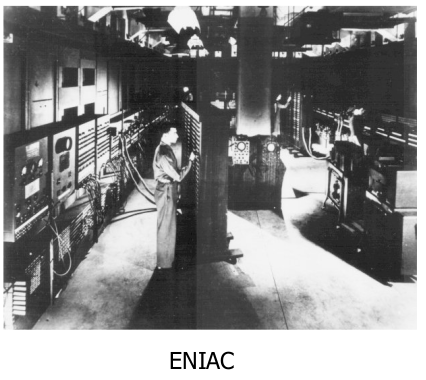
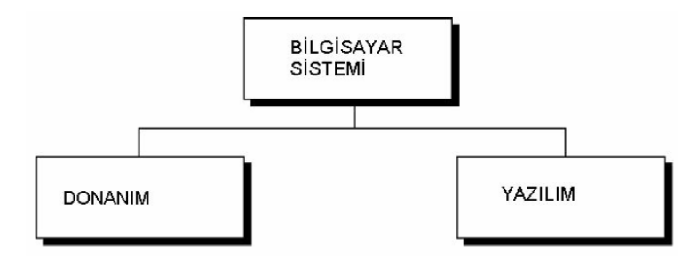
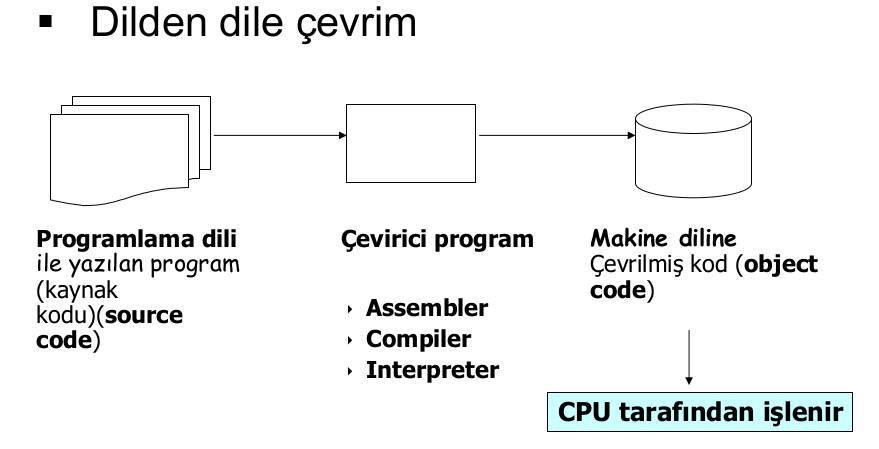

# Algoritmalar
Burası Temel Bilgisayar ve algoritma notlarımın olduğu yerdir.

# 1. Temel Kavramlar
## Bilgisayar
Verilen bilgileri saklayan, gerektiğinde bu bilgileri hızlı bir şekilde istenilen amaca uygun kullanmayı sağlayan/işleyen, mantıksal ve aritmetiksel işlemleri çok hızlı biçimde yapan bir makinedir. Bilgisayar terimi İngilizce “computer” kelimesinin  dilimize çevrilmiş halidir. Bu terim de Latince “compurate” kelimesinden gelmektedir.

Farklı bir tanım ile ; Bilgisayar, kullanıcıdan aldığı verilerle mantıksal ve aritmetiksel işlemleri yapan yaptığı işlemlerin sonucunu saklayabilen, sakladığı bilgilere istenildiğinde ulaşılabilen elektronik bir makinedir. Bu islemleri yaparken veriler girilir ve işlenir. Ayrıca, istenildiğinde yapılan işlemler depolanabilir ve çıkısı alınabilir.

**Giriş:** Kişi tarafından veya bilgisayar tarafından sağlanan verilerdir. Bu veriler, sayılar, harfler, sözcükler, ses sinyalleri ve komutlardır. Veriler giriş birimleri tarafindan toplanır. İşlem: Veriler insanların amaçları doğrultusunda, programın yetenekleri ölçüsünde işlem basamaklarından geçer.

**Bellek:** Verilerin depolandığı yerdir. Giriş yapılan ve işlenen veriler bellekte depolanır.

**Çıkış:** Bilgisayar tarafından işlem basamaklarından geçirilerek üretilen yazı, resim, tablo, müzik, grafik, görüntü, vb.nin ekrandan ya da yazıcı, hoparlör gibi degişik çıkış birimlerinden alınmasıdır.

Bilgisayarın nasıl çalıştığını öğrenmek için onun bilgileri nasıl kullandığını anlamak gerekir. Harfler ve rakamlar  bilgisayarda kodlar şeklinde ifade edildikten sonra kullanılır. Bilgisayarlarda kodlar elektrik olarak voltajın olup olmaması ile ifade edilir. Voltaj var, lamba yanıyorsa 1; voltaj yok, lamba yanmıyorsa 0 kodlarını alır. İki durumlu olan bu kodlamaya "ikilik sistem" denir. Bilgisayara tuşlardan verilen her bilgi 1 ve 0 kodlarına çevrilir. Her 0 ve 1, bit olarak; sekiz bitlik grup ise byte olarak tarif edilir. Bilgisayar, işlemlerini ikilik sayı sistemi ile yapar. İşlemler çok sade ve basit olmakla beraber çok hızlıdır.

Bilgisayarlar sadece sayıları saymakla kalmayıp karar da  verebilir. Bu kararlar, Boolean matematiği denilen mantık kaideler
kaidelerine ine göredir. Çeşitli şartlara göre bilgisayar EVET, HAYIR, VE, VEYA, DEĞİL gibi kararlar alabilir. Mesela; evi taşımak için bir kamyon VE bir şoföre ihtiyaç vardır. Bu kamyon bir dar köprüden geçmek zorundaysa kamyon geniş VEYA yüksekse köprüye çarpar. Taş Taşınacak ev boş DEĞiL ise taşıma işlemi
gecikecektir. Burada VE, VEYA,DEĞİL kararları verilmiştir.

### Bilgisayarların Gelişimi
#### Mekanik Çağ
 
Blaise Pascal (1642) Vites tabanlı toplama makinası

 
Gottfried Wilhelm von Leibniz (1670) Toplama, çıkarma, çarpma, bölme Mekanik olarak sık sık arızalanırdı.

 
Joseph Jacquard (1810) Bilgisayar tabanlı halı dokuma makinesi

 
Delikli Kart (Punch Card)

 
The Difference Engine (1822) Charles Babbage

 
Punch card’lar üzerinde yazılan programları işleyebiliyordu, Bilgiyi belleğinde saklayabiliyordu.

#### Elektro Mekanik Çağ(1840-1940)
 
Hermann Hollerith ( 19’uncu yüzyılın sonları).Amerikan oy sayımlarına kullanıldı.Elektrik ile çalışıyor.Bilgi punch card ile veriliyor.Nüfus: 63 milyon; 6 hafta,International Business Machines (IBM)’in ilk ürünü.

 
Howard Aiken + IBM + Harvard (1930) Veri depolama: Mekanik röle telefon anahtarları (switch). Girdi: Punch Card

#### İlk Yazılım Bug'ı
 
Grace Hopper (1909 – 1992) Mark I’in ilk programcılarından. Derleyicinin mucidi.

#### Elektronik Çağ(1840-Bugün)
Elektronik ile ilgili ilk deneylerin vakum tüplerinde
yapılan çalışmalar olduğu kabul edilir. Heinrich
Geissler (1814-1879), cam tüpün içinden havanın
çoğunu çıkartmış ve bu tüpün içinden elektrik akımı
geçirildiğinde tüpün parıldadığını görmüştür.

Sir William Crookes (1832-1919) havası alınmış
cam tüp’ün (vakum tüp) içinden akım geçirdiğinde,
geçen akımın parçacıklardan oluştuğunu görmüştür.

Sir Joseph Thompson (1856-1940) bu parçacıkları
ölçmeyi başarmıştır ve bu parçacıklara daha sonra
elektron denilmiştir.

John Ambrose Fleming, 1904 yılında, vakum tüpünü
kullanarak akımın tek yönlü olarak akmasına izin veren
vakum tüp diode’u geliştirmiştir. Bu cihaza “Fleming valve”
veya radio tube’de denir.

1930 yıllarında, elektronik dünyasında bir çok gelişme olmuştur. Bu yıllarda ilk elektronik hesap makineleri geliştirilmeye başlanmıştır.

John Atanasoff ve lisansüstü öğrencisi Clifford Berry, 1939 yılında, ABC (Atanasoff-Berry Computer) olarak adlandırılan ilk ikili sayı sisteminde çalışan makineyi geliştirmişlerdir. Bu makinada lojik işlemler için vakum tüpleri ve hafıza için kondansatörler kullanılmıştır.

Savaş sırasında bilgisayar konusundaki çalışmalar çok daha hızlı bir şekilde geliştirilmiştir. John von Neumann, 1946 yılında, ilk bilgisayar olarak kabul edilen Eniac’ı geliştirmiştir.

John Mauchly and J. Presper Eckert geliştirmiştir. 1946’da tamamlandı İlk olarak 2’inci dünya savaşında gizli bir proje olarak başladı.(University of Pennsylvania)

1000 metre kare alan kaplıyor,30 ton ağırlığında ve 17 binden fazla vacum tüpleri kullanıyordu.ilk gerçek bilgisayar. Programlama kablo temasları ve switch ayarları ile yapılıyordu.

1945 yılında Bell laboratuarlarında bir araştırma grubu kurulmuştur. Grubun amacı: iletkenler, yarıiletkenler, yalıtkanlar, piezoelektrik malzemeler ve manyetik malzemeler üzerinde temel araştırmalar yapmak, olarak tanımlanmıştır. Burada yapılan yarıiletkenler konusundaki çalışmalar sonucunda, Walter Brattain, John Bardeen ve William Shockley tarafından tranzistör icat edilmiştir. 1950 yılında bu yeni devre elemanının patenti alınmış ve 1951 yılında da Allentown Pennsylvania’da ticari olarak
üretilmeye başlanmıştır. Tranzistörün icadı elektronikte devrim niteliğindedir.

1950’li yıllarda yapılan araştırmalar sonucunda çok sayıda tranzistör, diyot ve kapasiteden oluşan devrelerin bir bütün olarak gerçekleştirilmesi yolu bulunmuştur. Böylece ortaya tümdevreler veya entegre devreler(integrated circuit) çıkmıştır.

1960 ve 1962 yılında yapılan çalışmalarda tümdevre teknolojisine
BJT’lere göre daha uygun olan Metal-oksit-yarı iletken alan etkili
tranzistör (metal-oxide-semiconductor field effect transistor-
MOSFET) geliştirilmiştir (Kahng ve Atalla, 1960), (Hofstein ve
Heinman, 1963). MOSFET transistorlerin gelişmesi ile birlikte tümdevre içine çok daha fazla sayıda transistor yerleştirilebilmiştir. Bir tümleşik
devredeki eleman sayısı 1964’te 40’a ve 1972’de 1200’e
yükselmiştir. 1982’li yıllarda VLSI (Very Large-Scale Integration)
olarak isimlendirilen sistemlerde 100,000’ler mertebesinde
eleman içeren tümleşik devreler gerçekleştirilmiştir.
Günümüzde bu elaman sayıları çok daha büyük değerlere
ulaşmıştır.

- Microprocessor :CPU içeren tek bir chip İlk olarak 1970 yılında Marcian Hoff (Intel Corporation) tarafından tasarlandı.
- Microcomputer :masaüstü boyutlarında bilgisayar ALTAIR (1975) Apple (Stephen Wozniak ve Steven Jobs; 1977)

### Temel Bilgisayar Mimarileri
**Von Neumann Mimarisi**

**Harvard Mimarisi**
Günümüz tipik bilgisayarları Von- Neumann Mimarisine
sahip Mikroişlemciler kullanırken (Intel x86, Pentium, AMD
Athlon..) , Özellikle Görüntü, ses işleme, yüksek hız
gerektiren uygulamalarda Harward mimarisine sahip
mikroişlemlerciler (DSP’ler, ARM Cortex..)

### Bilgisayar Sistemi
Donanım fiziksel aygıtlardır.Yazılım ise yapılması gereken işleri yapabilmek için donanıma komutlar veren programlar topluluğudur.

#### Donanım

Görevleri yapabilmek için komutları işleyen mikroişlemciye CPU denir.

**CPU :** Kontrol Ünitesi,Aritmetik Mantık Ünitesi(Arithmetic Logic Unit),Register

##### Bellek Türleri
- Registers: CPU’nun bir parçası; çok hızlı; sınırlı büyüklükte
- Cache Memory: CPU’nun bir parçası; RAM’den daha hızlı
- Read-only Memory: Bilgisayarın sürekli ihtiyaç duyduğu sistem komutlarını
barındıran çip
- Random Access Memory (RAM): Ana karta eklenen bellektir, program komutları ve veriler için birincil depo

##### Diğer Bilgisayar Bileşenleri
- Veri Depolama Sistemi: Hard disk, tape, floppy, DVD vs. Geniş alan, ucuz, yavaş, manyetik ve optik
- Input Cihazlari: Klavye, Fare, Dokunmatik ekran, Tarayıcı,
Webcam,Joystick,Mikrofon
- Output Cihazları: Monitör, Yazıcı, Plotter, Hoparlör

### Yazılım

1. Sistem Yazılımı
    1. Aygıt Yazılımı (firmware) (Bios)
        - Sistemi oluşturan donanımların çalışması için greekli olan yazılımlardır.
    2. İşletim Sistemi
        - Kullanıcı arayüzü, ağ bağlantı arayüzleri, Dosya erişimi
ve organizasyonu, Çoklu çalışma gibi hizmetleri sağlayan yazılımlardır.
Örneğin: DOS, Windows, Linux, PARDUS, Unixvs..
    3. Sistem Destek Yazılımı
        - Sistemle ilişkili faydalı yazılımlardır.
Örneğin,Disk formatlayıcı, hesap makinesi, test ve iletişim yazılımları,
Hyperterminal, Telnet vs..
    4. Sistem Geliştirme Yazılımı
        - Bunlar, çeşitli kütüphaneler, Uygulama
Programı arayüzü(API) (Winsock, setupapi, mmtools, SAPI, DDK..),
Derleyiciler, Debugger’lar..

2. Uygualama Yazılımı
    1. Genel Amaçlar
        - Kelime işlem programları: MS-Word, Word-Pro, ...
        - Veri tabanı yönetim programları: Oracle, Access, SQL, ...
        - Hesap Tablosu programları: MS-Excel, Lotus, ...
        - Grafik ve çizim programları: AutoCAD, 3D MAX, Photoshop, Corel Draw, ...
        - Matematik tabanlı programlar: MATLAB, MatCAD, Mathematica, ...
    2. Uygulamaya Özel
        - Özel yazılımlar

#### Program ve Yazılımın Tanımı
- **Program :** belirli bir işi gerçekleştirmek için gerekli komutlar dizisi olarak tanımlanabilir.
- **Programlama :** Bir programı oluşturabilmek için gerekli
komutların belirlenmesi ve uygun biçimde kullanılmasıdır.
- **Programlama Dilleri:** Bir programın oluşturulmasında
kullanılan komutlar, tanımlar ve kuralların belirtildiği
programlama araçlarıdır.
- **Yazılım :** Belirli bir amacı sağlayan, program yada programlar ve ilgili dokümantasyonlardır.

### Programlama Dilleri
Bilgisayarlara ne yapmaları gerektiğini söylememizi sağlayan özel bir dil Tüm yazılımlar programlama dilleri ile yazılır.

- **Makine Dili (birinci seviye):** Makine dili mikroişlemci ya da mikrodenetleyici gibi komut işleme yeteneğine sahip entegrelerin işleyebilecekleri komutlardan ve buna uygun söz diziminden oluşan dile verilen addır. Makine dili, işlemcinin verilen komutlar doğrultusunda çalıştırılmasını sağlayan ve işlemci mimarisine göre değişen en alt seviyedeki programlama dili dilidir. Bu dil sadece 0 ve 1 ikililerinin anlamlı kombinasyonlarından meydana gelmektedir. Bu nedenle, makine dilinin anlaşılması çok güçtür.

    Sonuç olarak bilgisayar programı hangi dilde olursa olsun formatı makine diline çevrilmesi evrilmesi gereklidir. Her emrin yerine getirilmesine ‘Instruction Cycle’ denir ve 4 ana kısımdan oluşur;
    - Fetch: Bir sonraki emri hafızadan getir.
    - Decode: Emrin ne demek istediğini çöz.
    - Execute: Emir yerine getirilir, işlem yapılır.
    - Store: Sonucu sakla.

    Kısaca özetleyecek olursak;
    - Bilgisayarın doğal dilidir.
    - Bilgisayarın donanımsal tasarımına bağlıdır.
    - Makine dili “010101001”’lerden oluşan komutlardır ve bunlar doğrudan makineye hitap eder.
    - Makine dili işlemci türüne özel olarak yazılmaktadır Dolayısıyla, bir işlemci türü için makine diliyle yazılmış program, diğer işlemciler için uygun olmamaktadır.
    - Bilgisayarın ana dilidir.
    - Bilgisayarın anlayabildiği tek dildir.
- Assembly Dili (ikinci seviye):
    - Makine diline birebir çevrilebilir
    - Makine dilinden daha rahat okunabilir.
        örn: ADD X Y Z
    - Assembler-assembly dilini makine diline çeviren program
- Procedural diller (üçüncü seviye):
    - Bir komut pek çok makine dili komutuna karşılık gelir
    - Programlarda bilgisayarın işlem akışını adım adım tasarlayabilirsiniz.
    - İnsan diline daha çok benzer; bilinen kelimeleri kullanır
        Örnek: C, C++, Java, Fortran, QuickBasic
    - Derleyici (compiler) – programın tümünü assembly veya makine diline çevirir (C++, Pascal, Ada).
    - Interpreter – program çalıştırıldığında adım adım programı makine koduna çevirir (Basic, Javascript, LISP)
- Nonprocedural diller(dönrdüncü seviye):
    - Kullanıcının sadece gerekli sorguyu göndermesi sonuca ulaşması için yeterlidir.Örnek: – veritabanı sorgulama dili- SQL
    - Teknik olmayan insanlar tarafından da kullanılabilir.
- Natural Language Programing
    - İnsan Dilini programlama diline çevirir
    - Oldukça karmaşık olarak nitelendirilir.

#### Programlama Dillerinin Tarihçesi
İlk programın, Ada Lovelace tarafından Charles Babbage’ın tanımlamış
olduğu “Analytical Engine” i ile Bernoulli sayılarının hesaplanmasına
ilişkin makalesinde olduğu söylenmektedir. Bu nedenle ilk gerçek
anlamdaki programlama dillerinden birinin adı Ada Lovelace anısına
ADA olarak isimlendirilmiştir.1940 larda ilk modern bilgisayar ortaya
çıktığında, programcılar yalnızca assembly dili kullanarak yazılım
yapabiliyorlardı.

- (1950 – 1960)
    - FORTRAN (1955), the"FORmula TRANslator
    - LISP, the"LISt Processor",
    - COBOL, the COmmon Business Oriented Language
    - ALGOL Algorithmic Language

### Yazılım Geliştirme Araçları
1. **Editörler-Tümleşik geliştirme ortamları(IDE):**
    - **Editörler :** Program kodlarını yazmak için kullanılan, metin düzenleyicilerdir. Program kodları saf metin biçiminde yazıldığından, herhangi bir metin düzenleyicisi, program yazılımı için kullanılabilir.
        - Kodlamadaki hatalar görülmez.
        - Anahtar kelimeler, fonksiyonlar ve parametreleri renklendirilmediğinden kod yazmak daha zordur.
        - Breakpoint, yada watch gibi, hata ayıklama unsurları yoktur.
        - Program derleme ve bağlama işlemi editör dışında genellikle komut satırı üzerinde yapılır.
    - **IDE (Tümleşik Geliştirme Ortamları) :** Tümleşik geliştirme ortamları, Genellikle derleyicileri–bağlayıcıları ortam içinden kullanabilmeyi yada derleyici ve bağlayıcıya ortam içinden erişme yollarını sağlarlar (Makefilevs..). Bunun yanı sıra;
        - Derleyici ve bağlayıcı tümleşik olan yapılarda Hata ayıklama, Gözlem penceresi gibi bileşenler mevcuttur.
        - Yazım işlemini kolaylaştıracak vurgulamalar ve uyarılar mevcuttur.
        - Derleyici ve bağlayıcı parametreleri menülerden ayarlanabilir.
        - Yardımlar mevcuttur.
        - Her yazılım dilinin kendi IDE si mevcuttur. Ancak bazı IDE’ler birden fazla yazılım dili için ortam sağlayabilir.
2. **Derleyicilerle birlikte kullanılır :** Bir derleyici, bir metin editörü yada IDE üzerinde yazılan program kodlarını, makinenin anlayabileceği OBJ kodlara dönüştüren bir uygulama yazılımıdır. Derleyicilerin birçoğu, Program dilinin yanısıra makine dilinin(assembly) de kullanılmasına izin verir.
3. **Derleyiciler-Bağlayıcılar (Compilers–Linkers):** Bir bağlayıcı, derleyici tarafından derlenmiş olan OBJ program kodlarını uygun bellek bölgelerine yerleştirerek, değişkenlerin ve sabitlerin bellek atamalarını ve ilklemelerini gerçekleyerek tek bir çalıştırılabilir program elde eden bir uygulama yazılımıdır (windows için exe dosya).
    
4. **Yorumlayıcılar (Interpreter) :** Yorumlayıcılar, program kodunu bir bütün olarak değerlendirmez. Program kodunu satır, satır yorumlayarak çalıştırırlar. Bu nedenle günümüzde derleyicilere göre daha kısıtlı uygulamalara sahiptirler, internet uygulamaları ve bilimsel alanda yaygın  kullanılmaktadırlar. 
Bazı yorumlayıcılar, yazılan program satırını, daha etkin bir
biçime çevirip, hemen uygularlar. Bunlar arasında: Perl,
Phyton, Matlab, Mathcad gibi yorumlayıcılar sayılabilir.
•Bazı yorumlayıcılar ise, yorumlayıcı sistemin bir parçası olan
bir derleyici tarafından önceden derlenip saklanmış kodları
uygularlar. Java bunlar arasında sayılabilir.

### Sayı Sistemleri
Günlük yaşantımızda 10 luk sayı sistemi kullanılır. Ancak, bilgisayar sistemleri 2 lik sayı sistemini kullanılırlar. 10 luk sistemde taban 10, ikilik sistemde taban 2 dir. Sayı sistemlerinde sayıyı oluşturan her bir rakam digit olarak adlandırılır. Onluk sayı sistemlerinde her bir rakam decimal digit yada sadece digitken, ikilik sistemde binary digit yada kısaca bit olarak adlandırılır.

<code>123456 --> 6 digitlik onlu sayı</code> 
<code>100101 --> 6 bitlik ikili sayı</code>

Sayı sembolleri 0 .. (Taban–1) arasındadır.
Onluk düzende rakamlar 0..9, ikilik düzende rakamlar 0 , 1 den oluşur.

Sayıların oluşturulması <code>123456 = 1x105 + 2x104 + 3x103 + 4x102 + 5x101 + 6x100</code> 
<code>100101 = 1x25 + 0x24 + 0x23 + 1x22 + 0x21 + 1x20
</code>

Sekiz bitlik ikili sayılara bir byte lık sayılar denir 
<code>10011101 --> 8 bit yada bir byte</code>
        
16 bit uzunluklu sayılara 1 word luk sayılar sayılar
denmesine rağmen, bu kavram bazen işlemcinin veri yolu
uzunluğu kadar bit sayısı ile de eşleştirilmektedir.
11001001 11100011 2 byte lık sayı.
Ayrıca her 4 bit, bir Nibble olarak adlandırılır.

#### Pozitif ve Negatif  Sayılar
<code>00000000 (decimal 0)</code> 
<code>11111111 (decimal 255)</code>

Buradaki tüm sayılar, pozitiftir.

Bir başka deyişle sayı işaretsizdir. Negatif sayılar söz konusu olduğunda bu sayıların yarısının pozitif, yarısının negatif olduğu söylenebilir.

Örneğin 1 byte’lıksayı -127 ile +127 arasında değişecektir.İkilik sistemde negatif sayılar, çıkarma işleminin toplama aracılığıyla yapılabilmesini sağlamak amacıyla tümleyen sayılarla gösterilir.Tümleyen sayı, verilen sayıyı, o bit sayısı için temsil edilen en büyük sayıya tamamlayan sayıdır. (Pratikte bit evirerek yapılır.)

Örneğin 00001010 ın tümleyeni 11110101 dir. (255 –10). Bu türden tümleyene 1’e tümleyensayı denir. Dikkat edilirse en ağırlıklı (en soldaki) bit negatif sayılar için 1 olmaktadır. Pratikte pek kullanılmaz, çünkü burada iki tane 0 söz konusudur (0000 0000 ve 1000 0000) ve işlemcinin doğrudan toplamasıyla çıkarma elde edilemez.

* **İkiye Tümleyen**
 
* **Hexadecimal sayılar**
Bilgisayar sistemlerinde uzun bit dizilerini temsil etmek zor olacağı için yazım biçimi olarak hexadecimal sayılar tercih edilmektedir. Hex sayılar 16 lık sayılardır. Herbir Nibble bir Hex sayı ile temsil edilebilir. Böylelikle ikili sayının yazım uzunluğu 4 te bir digite düşecektir. 
    **Hex sistemde sayılar 16 sembolden oluşur ve aşağıdaki gibidir.**
     
    **örnek:**
    <code>0011 1010=3A Hex</code>, <code>1110 0101=E5 Hex</code>, <code>0101 1101 1100 1001 0110 0111=5DC967 Hex</code>

### Kod Sistemi
Bilgisayarlar yalnızca sayılarla çalışırlar, oysa bizim harflere ve diğer sembollere de gereksinimimiz vardır. Bu semboller de sayılara karşılık düşürülecek biçimde kodlanırlar. Program örneğin bu sayı ile karşılaşırsa ekrana karşılık düşen sembolü basar, yada klavyeden gelen sayının sembolik karşılığını , yazıcıdan çıkarır.

Bir çok kodlama türü olmasına karşın dünyada bilgisayar ortamlarında **ANSI** tarafından 1963 yılında standartlaştırılan **ASCII**(**A**merican **N**ational **C**ode for **I**nformation **I**nterchange) kodlaması yoğun olarak kullanılmaktadır. Ancak günümüzde , **ASCII** kodları çok dilliği sağlayabilmek için yetersiz kaldığından **UNICODE** kodlaması yaygınlaşmaktadır. Ancak pek çok uygulamada **ASCII** kodlaması hala geçerliliğini korumaktadır.

ASCII temel olarak 7 bit’ tir. 127 karakterden oluşur. Ama Extended kısmıyla birlikte 8 bit kullanılmaktadır. Ancak genişletilmiş kısımdaki semboller yazılım ortamına göre değişebilmektedir.

**ASCII ilk 128 sembol**

**ASCII genişletilmiş kısım**

